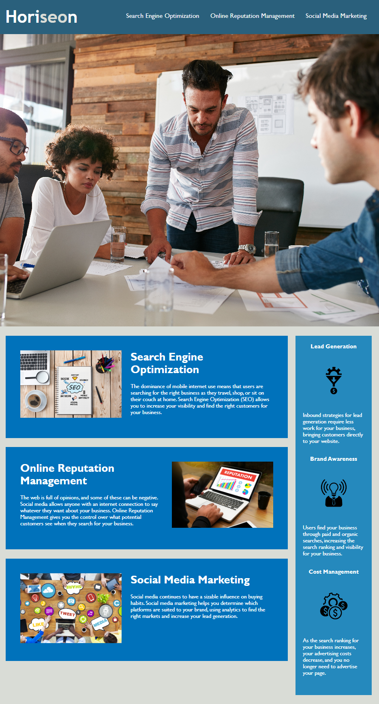

# Frontend web development bootcamp - Week 1 challenge
## Description

The purpose behind this project was to refactor code on an existing site to:
- meet accessibilty standards
- improve the codebase
- ensure all elements are displaying correctly (size and spacing)

## Installation

N/A

## Usage

If you inspect the page, you can view the comments in both the HTML and CSS files to see what I changed and why.

## Credits

N/A

## License

Refer to the LICENSE in the repo.

---